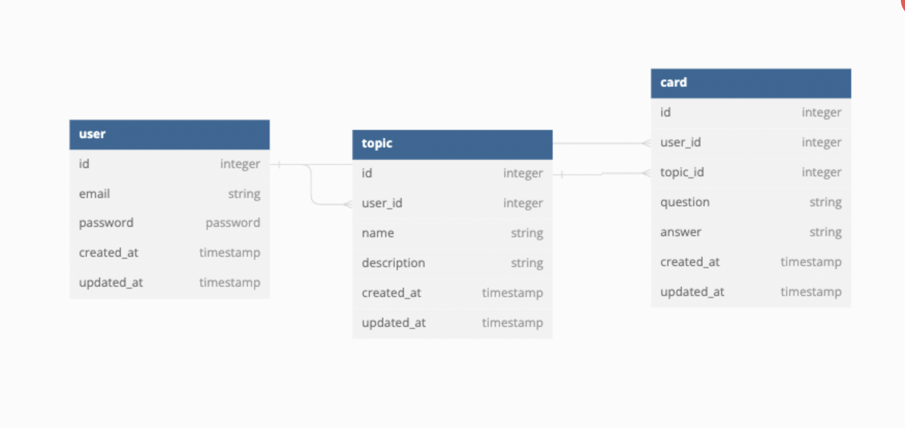

# Brain Buddy
Brain Buddy is the ultimate companion for your learning journey!  Revolutionize the way you study and retain information with our cutting-edge flashcard application. Whether you're a student, professional, or lifelong learner, Brain Buddy adapts to your unique learning style.

Brain Buddy API was built using Ruby on Rails and tested using Rspec covering a total of 99.72% of the code base.

## Structure
MVP for Brain Buddy is to have a simple, yet efficient application that allows a user to create flashcards and group them to a topic. To implement this, there are currently 3 tables - User, Topic, and Card as seen in the diagram below:

## Running the Backend with Ruby on Rails:
To get the Brain Buddy backend up and running using Ruby on Rails, follow these steps:

1. Clone the repository: `git clone https://github.com/elysemontano/brain-buddy.git`
2. Navigate to the backend directory: `cd brain-buddy`
3. Install Ruby dependencies: `bundle install`
4. Run the backend server with Rails: `rails server` 
5. Access the backend at `http://localhost:3000`.

## Future Goals
The goal for Brain Buddy goes beyond MVP and will integrate the ability to share and save topics, search categories, and score your proficiency in a topic. Stay tuned for future updates!